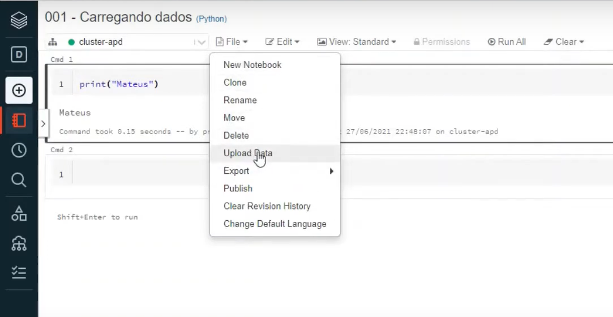
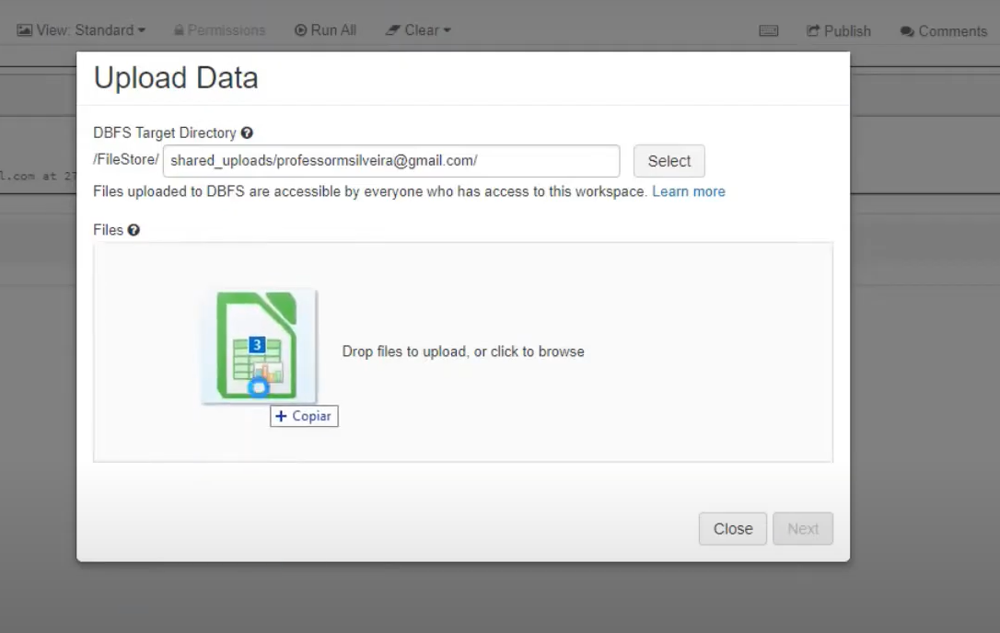

# Databricks + PySpark
# Introdução

### O que é Databricks

Databricks é uma plataforma de análise baseada no Apache Spark, que oferece um ambiente unificado e colaborativo para cientistas de dados, engenheiros de dados e analistas de negócios. A plataforma facilita fluxos de trabalho simplificados e um workspace interativo, suportando o desenvolvimento em Python, Scala, R e SQL.

### O que é PySpark

O Apache Spark é um framework de computação distribuída escrito em Scala. PySpark é a API Python para Spark, lançada para permitir a colaboração e o uso de Spark com a linguagem Python.

## Criação de Cluster

1. Na barra lateral esquerda, selecione a opção "Compute".
2. Clique em "Create Cluster" para ver os clusters existentes ou criar um novo cluster.

### O que é um Cluster?

Um cluster é um conjunto de máquinas (nós) que executa scripts e tarefas distribuídas. É essencial para a execução de scripts no Databricks.

### Criando um Cluster

1. Clique em "Create Cluster".
2. Preencha o nome do cluster como "cluster - apd (aprendendo)".
3. Clique novamente em "Create Cluster".

## Carregando, Lendo e Escrevendo Dados

### Preparação do Ambiente

Foram fornecidos três arquivos CSV:

1. `marca_carro.csv` (marca_carro, cod_marca)
2. `marcas_duplicadas.csv` (marca_carro)
3. `modelo_carro.csv` (id_carro, modelo_carro, preco, cod_marca)

### Criando um Notebook

1. Acesse o Databricks.
2. Navegue até o "Workspace".
3. Clique com o botão direito e selecione "Create Notebook".
4. Nomeie o notebook como "001 - carregando dados".
5. Selecione "Python" como a linguagem.
6. Vincule o notebook ao cluster criado anteriormente.
7. Clique em "Create".

### O que é um Notebook?

Um notebook é um ambiente interativo onde você pode escrever e executar código em blocos. Cada bloco pode conter um trecho de código, como:

```python
print("Hello World")

```

### Carregando Dados

Para carregar os arquivos CSV no Databricks:

1. Clique em "File" no menu superior e depois em "Upload Data":
    
    
    
2. Na janela de upload, selecione os arquivos CSV:
    
    
    
3. Clique em "Next" e selecione a opção para ler os arquivos com PySpark.
4. Clique em "Copy" para copiar o comando de leitura e depois em "Done".

### Executando o Comando no Notebook

O comando copiado será algo como:

```python
df1 = spark.read.format("csv").option("header", "true").load("/dbfs/FileStore/tables/marca_carro.csv")
df2 = spark.read.format("csv").option("header", "true").load("/dbfs/FileStore/tables/marcas_duplicadas.csv")
df3 = spark.read.format("csv").option("header", "true").load("/dbfs/FileStore/tables/modelo_carro.csv")

```

### Lendo Dados

Para visualizar os dados carregados, use o método `display`:

```python
display(df1)

```

Para executar qualquer bloco de código, clique em `Ctrl + Enter` ou no ícone de play no canto superior direito do bloco. Para executar todos os blocos em sequência, clique em "Run All" no menu superior.

### Escrevendo Dados

Para salvar os DataFrames em diferentes locais:

```python
# Salvando em um novo caminho (gera erro se já existir)
df1.write.format("csv").save("/caminho/novo/para/salvar.csv")

# Sobrescrevendo o arquivo existente
df1.write.format("csv").mode("overwrite").save("/caminho/para/salvar.csv")

# Acrescentando ao arquivo existente
df1.write.format("csv").mode("append").save("/caminho/para/salvar.csv")

```

### Mais Opções de Leitura

Para configurar a leitura de arquivos CSV, você pode definir várias opções, como a inclusão de um cabeçalho, o delimitador de campos e o encoding do arquivo.

```python
# Definindo a primeira linha como cabeçalho e especificando o delimitador como vírgula
df_carros = spark.read.format("csv").option("header", True).option("delimiter", ",").load("/caminho/do/arquivo.csv")
display(df_carros)

# Outra forma de especificar o delimitador é utilizando o parâmetro "sep" diretamente no método load
df_carros = spark.read.format("csv").option("header", True).load("/caminho/do/arquivo.csv", sep=",")

# Caso seja necessário especificar o encoding, adicione a opção correspondente
df_carros = spark.read.format("csv").option("header", True).option("delimiter", ",").option("encoding", "utf-8").load("/caminho/do/arquivo.csv")

```

Além de arquivos CSV, é possível ler e escrever arquivos em outros formatos como Parquet, Avro e JSON:

```python
# Salvando o DataFrame em diferentes formatos
df_carros.write.format("parquet").save("/caminho/onde/deseja/salvar")
df_carros.write.format("avro").save("/caminho/onde/deseja/salvar")
df_carros.write.format("json").save("/caminho/onde/deseja/salvar")
```

Para ler arquivos , o processo é similar:

```python
# Lendo um arquivo JSON
df_json = spark.read.format("json").load("/caminho/do/arquivo/json")
```

### Considerações Finais

Com estes passos, você estará apto a carregar, visualizar e salvar dados no Databricks utilizando PySpark. Esta plataforma facilita a colaboração e a análise de dados em grande escala, proporcionando um ambiente robusto e flexível para os profissionais de dados.
